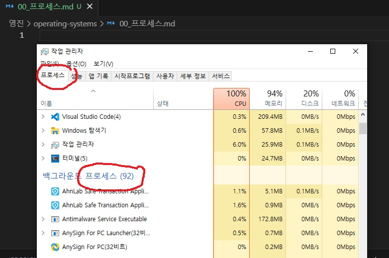
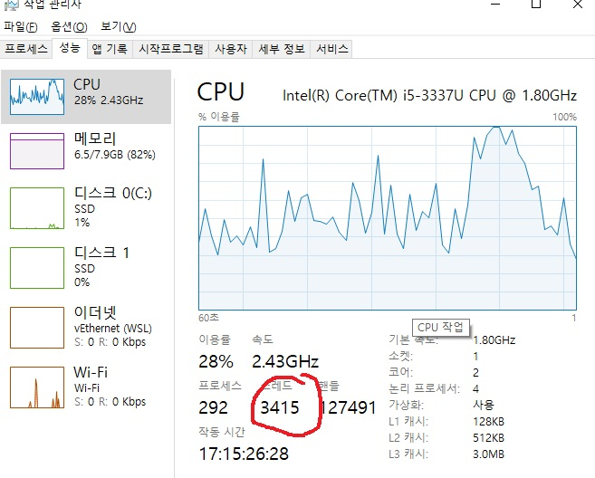
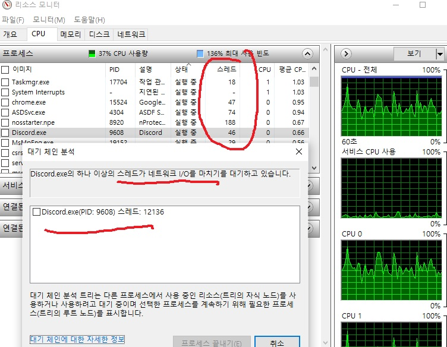

# CONTENTS

```
    1. 프로세스
        
        - 프로세스의 정의
            - 프로그램 vs 프로세스
        
        - 프로세스의 상태변화
        
        - 프로세스의 생성과 종료
        
        - 프로세스의 종류
            - 독립적 프로세스
            - 유기적 프로세스

        - 프로세스의 주소공간


    2. 스레드
        
        - 스레드의 정의
        
        - 멀티스레드

```
---

# DETAILS

## 1. 프로세스


### process의 사전적 정의
```
a series of actions or steps taken in order to achieve a particular end.

특정 결과를 달성하기위한 단계나 행동의 나열
```

### 컴퓨터의 프로세스

실행중인 프로그램을 의미




### 프로그램 vs 프로세스

- 프로그램
    - 특정 목표를 달성하기 위해 작성된 코드와 데이터의 집합.

    - 동작을 하지 않는 수동적 개체

- 프로세스

    - 실행에 필요한 자원을 할당하여 실행되고 있는 상태의 프로그램

    - 동작을 하는 능동적인 개체

### 프로세스의 상태전이


1. 생성상태 (new)
    - 작업이 주어지고, 프로세스가 생성된 상태.
    - 프로세스 큐에 삽입

<br>

2. 준비상태 (Ready)

    -  cpu의 프로세서 할당을 대기하는 상태

    -  프로세스는 프로세서에의해 실행

<br>

3. 실행상태 (Running)

    - 프로세서를 할당받아 실행중인 상태

    - 디스패치:(dispatch)스케줄러의 알고리즘을 통해 정해진 순서대로 준비상태에서 실행상태로 전이하는것 

<br>

4. 대기상태 (wait)

    - 프로세스가 특정한 이벤트나 다른자원을 기다려야해서 실행을 중단한 상태

    - 대기중인 이유가 해소된경우, 준비상태로 전환후 프로세서 할당을 대기

    - 이벤트는 새로운 Read,Write, 입출력(I/O)장치 요청, 페이지 교체작업, OS의 작업 순서 알고리즘에서 우선순위가 밀린경우등이 있음

5. 종료상태 (terminated)

    - 프로세서가 작업을 완수하거나, 오류로 종료된 상태
    - 실행을 위해 할당되었던 자원을 반환
        - 파일, 메모리, 네트워크 연결등 여러 자원을 정리
    -  작업의 상태를 보고


### 프로세스의 생성과 종료

프로세스에대한 가장 기본적인 연산

### 부모 프로세스와 자식 프로세스

프로세스가 실행중에, 프로세스 생성 시스템 호출을 통해 여러개의 하위 프로세스를 생성 할 수 있음

이때 생성의 주체를 부모 (parent), 생성된것을 자식(childeren) 프로세스라고함

- ex) 가상환경 linux: 부모 / vscode: 자식


### 프로세스 생성에 필요한 것들

- 프로세스 명명 
- 준비큐에 삽입(작업실행 우선순위 부여)
- 프로세스 제어블록(Process Control Block) 제작
- 부모의 자원이나 운영체제의 자원을 자식에게 할당


### 프로세스 종료

프로세스의 실행을 마치고 부모 프로세스에게 실행결과를 반환

- 마지막 문의 실행이 끝나면 종료

- 부모에 의한 종료

    - 자식이 할당한 자원의 사용을 초과사용
    
    - 자식에게 할당했던 작업이 필요치 않을때 (자식의 존재 의의가 없음)
    
    - 부모가 종료시 연결된 자식도 종료
        - cascading termination


### 프로세스의 종류

독립적 프로세스 (independent process)

다른 프로세스와의 상호작용이 없는 프로세스

- 특징
    - 상태가 다른 프로세스와 공유되지 않음
    - 중단이나 재시작은 다른 프로세스와 무관
    - 프로세스 자체가 멱등성을 띔
        - 결정적이고, 재현가능함
        - 입력상태에 의해서만 실행결과가 결정되며, 같은결과를 반복적으로 재생성 가능함

유기적 프로세스 (cooperating process)

실행중인 다른 프로세스와 상호작용 하는 프로세스

협력프로세스라고도 불림

- 특징
    - 상태가 다른 프로세스와 공유됨
    - 프로세스의 실행결과는 비결정적이며 재현 불가능 하다
        - 입력상태와 더불어 실행순서에의해 결과가 결정
        - 동일한 입력에대하여 항상 동일한 결과를 내놓지 않음

### 프로세스 주소공간

유기적 프로세스를 기준으로 한 그림


프로세스가 실행되는동안 사용할 수 있는 메모리공간

커널 / 프로그램 코드 및 데이터 / 스택 / 힙 /  공유자원 등으로 구성

- 커널 영역 (kernel)
    - 프로세스가 실행 중에 운영체제의 서비스나 기능을 호출하거나 요청할 때 사용

<br>

- 프로그램 코드 영역
    - 프로그램의 명령어들을 저장
    - CPU는 여기서 명령어를 읽어옴

<br>

- 데이터 영역
    - 정적, 전역변수 저장
    - 데이터를 공유하여 메모리를 아끼기 위해 사용
<br>

- 스택 영역
    - 함수 호출과 관련된 데이터 및 지역 변수를 저장하는 스택프레임(Stack Frame)을 쌓는곳
    - 함수 호출시마다  스택프레임을 생성
        -  함수의 매개변수, 지역 변수, 복귀주소, 기타 제어정보 저장


- 힙 영역

    - 동적으로 할당된 메모리를 관리
    - 실행 중에 필요한 크기의 메모리를 동적으로 할당 및 해제.
    - 주로 동적 데이터 구조(배열, 연결 리스트)를 위해 사용

<br>

- 공유자원 영역
    - 여러프로세스간 데이터를 공유하기위한 메모리영역
    - 프로세스간 협력에 사용
        - IPC(Inter-Process Communication)에 이용
        
<br>

## 2. 스레드

### thread의 사전적 정의

```
a long, thin strand of cotton, nylon, or other fibers used in sewing or weaving.

a theme or characteristic, typically forming one of several, running throughout a situation or piece of writing.

fundamentally, a clear, well-defined theme, subject, topic or focus. 

특정 테마나 특징을 가진 잘 짜여진 섬유,  상황, 글등의 연속체를 의미
```

### 컴퓨터의 스레드

프로세스의 자원소유와 제어흐름 중 제어흐름만을 다루는 실행단위


병렬처리를 위해 도입된 개념

- 기존의 실행단위인 프로세스는 자원 소유의 단위로 취급

- 경량 프로세스 라고도 불리움
<br>

작업관리자의 성능탭에서 실행중인 스레드를 볼 수있음.


### 멀티 스레드

multiThread

처리효율을 극대화 하기위하여 프로세스 내부에서 스레드를 병렬적으로 수행하는 기법

시간을 포함한 잉여 컴퓨터자원의 낭비를 막아줌

프로세스가 중지되지않기위해 안정성을 유지하는 기법이 필요

### 멀티스레드의 안정성 구현을 위해 이해해야하는 개념

|용어|설명|
|--|--|
|한정된 자원 <br> (BoundResource)| 시스템내의 자원은 한정적|
|상호배제 <br> (Mutual Exclusion)|여러 프로세스, 스레드가 동시에 공유자원에 접근할 수 없게 해야함|
|기아 <br> (Starvation)|스레드가 필요한 자원을 얻지못해 계속 대기하는 상황|
|데드락 <br> (Deadlock)|여러 프로세스가 자원획득을 위해 다른 프로세스의 종료를 영원히 기다림|
|라이브락 <br> (Livelock)|데드락과는 다르게 동작은 하지만, 프로세스의 진행을 못함|

리소스매니저를 누르면 프로세스별 할당 스레드 수를 볼수있음


--- 

# QUSETION

1. 프로세스의 상태 전이도를 그리고, 각 상태를 설명해주세요.

2. 유기적 (협력적) 프로세스를 사용하는 이유는 무엇인가요?

